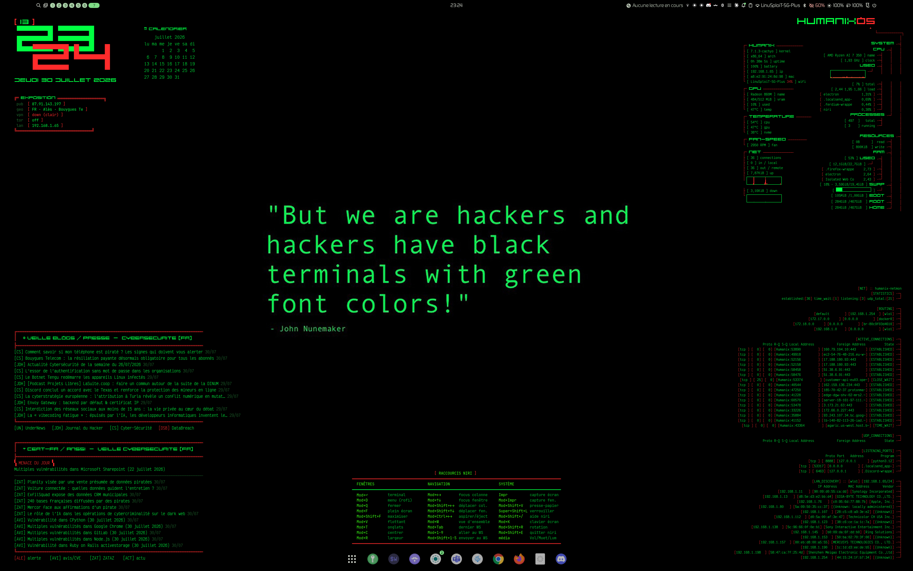

# Humanix

> **Make Hacker Cool Again.**
> Distro-signature offensive bâtie sur un fork d'**Athena OS** (NixOS), compositor
> **niri**, esthétique *Mr Robot* phosphore-vert CRT. Un poste de pilotage unique
> pour le pentest, la RF et la bidouille embarquée — sans jamais sacrifier le boot.



---

## 1. Ce que c'est

Humanix transforme un fork Athena OS en distribution personnelle cohérente :

- **Base** : NixOS 26.11 (fork Athena OS), configuration **en flake**.
- **Compositor principal** : **niri** (tiling scrollable, shaders GLSL). Sessions
  **Hyprland** et **GNOME** disponibles en parallèle (proposées au login).
- **Esthétique** : Stylix (palette figée) + thème `hackthebox` + accents CRT
  `#00ff41`, wallpaper animé, conky-dashboard système.
- **Arsenal** : suite cyber Athena complète (12 rôles, ~430 paquets) + arsenal
  RF/embarqué (SDR, Flipper, Proxmark, flash MCU…).
- **Namespace unifié** : toute la config maison est sous `humanix.*` (options
  débrayables). Le branding/paquets Athena (`athena-welcome`, thèmes…) est conservé.

Matériel de référence : **HP OmniBook**, **Ryzen AI 7 350**, **Radeon 860M**,
disque **chiffré LUKS** (btrfs).

---

## 2. Architecture

```
nixos/
├── flake.nix              # inputs (nixpkgs unstable, home-manager, stylix, cachyos, claude…)
├── flake.lock             # verrou de versions (committé)
├── configuration.nix      # point d'entrée : toggles humanix.*, users, réseau, cyber
├── default.nix            # module racine : déclare les options humanix.{enable,theme,…}
├── hardware-configuration.nix
├── secrets.nix.example    # gabarit (le vrai secrets.nix est GITIGNORÉ ; agenix pour les clés)
├── modules/
│   ├── design/            # stylix, plymouth, aesthetic (profil), thèmes
│   ├── hardware/          # arsenal.nix (RF/embarqué), kernel-cachyos.nix
│   ├── cyber/             # rôles pentest (web, red, osint, forensic…)
│   ├── dms/greetd/        # login cracktro (shader GLSL + gtkgreet + chiptune)
│   ├── security/          # durcissement (hardening.nix) + nixpkgs-fixes.nix
│   └── claude-desktop.nix
├── home-manager/desktops/ # niri, hyprland (options humanix.niriShader, …)
└── docs/                  # arsenal.md, boot-login.md
```

**Flake — nixpkgs.** Suit désormais la branche `nixos-unstable` (dépinglé le
2026-07-30 pour la mise à jour sécu ; l'ancien pin-rev servait à éviter le rebuild
massif au passage en flake). Mise à jour volontaire via `nix flake update`. Un
overlay daté (`modules/nixpkgs-fixes.nix`) corrige quelques paquets transitoirement
cassés sur unstable.

---

## 3. Build & bascule

> ⚠️ **1re bascule uniquement** : les flakes ne sont pas encore activés dans le
> `nix.conf` courant. On les amorce via `NIX_CONFIG` le temps d'un switch (ensuite
> `nix.settings.experimental-features` prend le relais, plus besoin de l'env).

```bash
# 1) Test sans rien appliquer (recommandé)
nix build "/home/fdurano/nixos#nixosConfigurations.Humanix.config.system.build.toplevel" \
  --extra-experimental-features "nix-command flakes" --no-link

# 2) Première bascule (amorçage flakes)
sudo NIX_CONFIG="experimental-features = nix-command flakes" \
  nixos-rebuild switch --flake /home/fdurano/nixos#Humanix

# 3) Bascules suivantes (flakes déjà activés)
sudo nixos-rebuild switch --flake /home/fdurano/nixos#Humanix
```

**Filet de sécurité** : en cas de souci au boot ou au login, sélectionner la
**génération précédente** dans le menu de démarrage (rien n'est détruit).

---

## 4. Toggles `humanix.*`

Tout est débrayable. Réglages principaux (dans `configuration.nix`) :

| Option | Valeurs | Rôle |
|---|---|---|
| `humanix.aesthetic.profile` | `showtime` \| `work` \| `client` | Ambiance : spectacle / quotidien / sobre en clientèle |
| `humanix.aesthetic.plymouth.enable` | bool (défaut `false`) | Splash graphique (⚠️ voir §7) |
| `humanix.animatedWallpaper` | bool | Wallpaper animé (piloté par le profil) |
| `humanix.niriShader` | str (`glass-warp`…) | Shader d'animations niri |
| `humanix.kernel.cachyos.enable` | bool | Kernel CachyOS |
| `humanix.kernel.cachyos.variant` | `lts` \| `bore` \| `eevdf` \| `hardened` | Variante (défaut `lts`) |
| `humanix.hardware.arsenal.enable` | bool | Groupes + règles udev (accès devices sans root) |
| `humanix.hardware.sdr.enable` | bool | Outils SDR CLI |
| `humanix.hardware.sdr.gui.enable` | bool | GUI SDR lourdes (opt-in) |
| `humanix.hardware.embedded.enable` | bool | Toolchains flash/série + Flipper |
| `cyber.role` / `cyber.roles` | voir §6 | Sélection de l'arsenal pentest |

---

## 5. Matériel supporté (matrice)

Activé par `humanix.hardware.arsenal.enable = true` (règles udev + groupes) et les
toolchains associées. Accès sans root via `TAG+="uaccess"` (logind) + groupe filet.

| Famille | Exemples | Vendor:Product | Accès | Toolchain (toggle) |
|---|---|---|---|---|
| **Série FTDI** | adaptateurs USB-TTL | `0403` | dialout/uaccess | `tio`, `minicom`, `picocom` *(embedded)* |
| **CH340/CH341** | ESP32, clones Arduino | `1a86` | dialout/uaccess | `esptool`, `arduino-cli` *(embedded)* |
| **CP210x** | ESP32, T-Embed, T-Dongle | `10c4` | dialout/uaccess | `esptool`, `platformio` *(embedded)* |
| **Arduino** | Uno/Nano/Leonardo | `2341` | dialout/uaccess | `arduino-cli`, `avrdude` *(embedded)* |
| **SparkFun** | boards SF | `1b4f` | dialout/uaccess | `arduino-cli` *(embedded)* |
| **Flipper Zero** | VCP STM32 | `0483:5740` | dialout/uaccess | `qFlipper` *(embedded)* |
| **DFU STM32** | Flipper recovery, bluepill | `0483:df11` | plugdev/uaccess | `dfu-util` *(embedded)* |
| **RP2040 / Pi Pico** | Pico, picoprobe | `2e8a` | plugdev/uaccess | `picotool`, `openocd` *(embedded)* |
| **Proxmark3** | RDV4 & co | `9ac4`, `502d` | plugdev/uaccess | *(à compléter : proxmark3)* |
| **Crazyradio / nRF** | MouseJack, jackit | `1915` | plugdev/uaccess | *(à compléter : jackit)* |
| **ST-Link v2 / v2.1** | SWD/JTAG | `0483:3748/374b` | plugdev/uaccess | `openocd` *(embedded)* |
| **RTL-SDR** | dongles DVB-T | *(règles fournies)* | plugdev/uaccess | `rtl-sdr`, `rtl_433` *(sdr)* |
| **HackRF** | One | *(règles fournies)* | plugdev/uaccess | `hackrf`, `soapysdr` *(sdr)* |

> GUI SDR (`gqrx`, `gnuradio`, `urh`, `sdrangel`) : `humanix.hardware.sdr.gui.enable`.
> Détails et hors-nixpkgs (jackit, firmwares) : [`docs/arsenal.md`](docs/arsenal.md).

---

## 6. Poste de travail (niri)

Workspaces nommés, apps lancées et rangées automatiquement (`open-on-workspace`) :

| WS | Nom | Contenu |
|---|---|---|
| 1 | `term` | Terminal (wezterm, plein largeur) |
| 2 | `ide` | Antigravity + VSCodium |
| 3 | `web` | Firefox + Chrome |
| 4 | `chat` | Discord · Teams (natifs) + **Ferdium** (Slack, WhatsApp, IA web… — 1 seul Chromium) |
| 5 | `llm` | **Claude Desktop** (plein écran) |
| 6 | `mail` | **LocalSend** (transfert LAN) + **KeePassXC** (coffre) |

**Arsenal cyber** : `cyber.role` (rôle principal) + `cyber.roles` (liste, union
dédupliquée). Humanix active les **12 rôles** (`blue, bugbounty, dos, forensic,
malware, mobile, network, osint, red, student, web` + `cracker`), soit ~430 outils.

---

## 7. Boot, login & kernel

- **Bootloader** : **GRUB-EFI** thémé *Mr Robot* en résolution native **2880×1800**
  (menu net + prompt LUKS/Plymouth nets). Machine EFI (ESP `/efi`, kernels sur
  `/boot` non chiffré, LUKS déchiffré par l'initrd) → GRUB en mode EFI (`efiSupport`
  + `device="nodev"`), **pas** en BIOS+cryptodisk.
- **Splash** : **Plymouth** vert (thème HUMANIX), `splash` sans `quiet` → les logs
  noyau/init défilent (vibe dmesg) et le splash s'affiche sur le prompt de
  déchiffrement + le spinner. Console en palette **phosphore vert** dès le boot.
- **Login** : **cracktro** façon démo Amiga — `greetd` lance une session sway avec
  un **shader GLSL** (copper bars, plasma, starfield, logo + scroller sinus, via
  glpaper), **gtkgreet** vert monoligne et une **chiptune 8-bit** (Eric Skiff,
  CC-BY). Clavier **AZERTY**. Échappatoire si le login graphique casse :
  Ctrl+Alt+F2 → TTY. Repli une ligne : `humanix.login.cracktro.enable = false`.
- **Kernel** : CachyOS **BORE** (7.1.3) — boote nickel. La variante **`hardened`
  bleeding-edge paniquait** sur cet APU → repli `lts` si besoin. Cache binaire
  Attic (lantian) pour éviter la compilation locale.

Détails : [`docs/boot-login.md`](docs/boot-login.md).

---

## 8. Secrets

Les mots de passe **ne sont pas gérés en déclaratif** : `mutableUsers = true` +
gestion manuelle (`passwd`). Un `hashedPassword`/`hashedPasswordFile` avait par le
passé provoqué un **lockout** (récupération via live-USB) → à proscrire ici.
`secrets.nix` est **gitignoré** (voir `secrets.nix.example`). Les secrets
applicatifs (clés API OSINT, profils WireGuard) passent par **agenix** (chiffrés,
donc versionnables). **Ne jamais committer `secrets.nix`.**

---

## 9. Garde-fous légaux

Humanix est un outillage de **sécurité offensive à usage strictement autorisé** :
tests d'intrusion sous mandat, CTF, recherche et défense. L'emploi de cet arsenal
contre des systèmes, réseaux ou fréquences sans autorisation écrite est illégal.
L'utilisateur est seul responsable du respect du cadre légal (informatique **et**
radio/RF) de sa juridiction.

---

## 10. État & suite

- ✅ Flake + namespace `humanix.*` unifié · mots de passe `mutableUsers` (manuel)
- ✅ Arsenal RF/embarqué · kernel BORE · 12 rôles cyber (~430 outils)
- ✅ **Login cracktro** (shader GLSL + chiptune) · **GRUB-EFI Mr Robot** 2880×1800
  · Plymouth vert · console phosphore
- ✅ **Rice conky** : monitor système, dashboard réseau (netmon), veille cyber FR
  (CERT-FR + blogs), bloc « exposition » OPSEC, cheatsheet des raccourcis niri
- ✅ **Durcissement** `humanix.hardening` (sudo wheel-only, auditd, sysctl offensif-safe)
- ✅ nixpkgs sur **unstable** + overlay correctifs · secrets applicatifs **agenix**
- ⏭️ Unifier les palettes (Stylix/CRT/hackthebox) · compléter l'arsenal (proxmark3,
  jackit, firmwares) · retirer l'overlay `nixpkgs-fixes` quand upstream corrige
